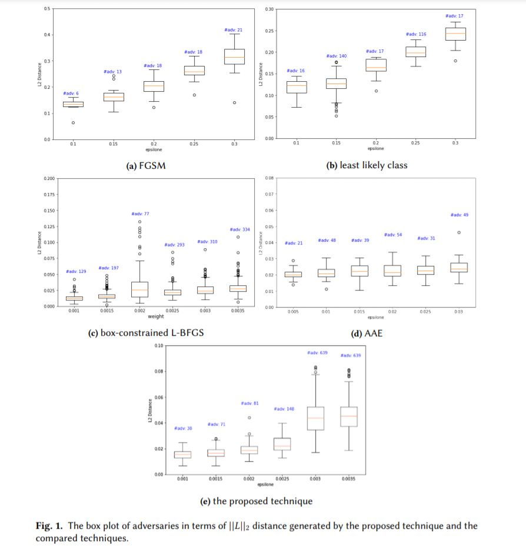

# AdvGeneration

## Installation

- **pip install -r requirements**

## Run
- Generate adversarial example: *//todo*

## Experimental results

1. Quality of adversaries in terms of  distance. 

The experiment in this part follows this strategy. Specifically, for FGSM, the value of 𝜖 changed from 0.1 to 0.3 with a step of 0.05. For least likely class, the value of 𝜖 changed from 0.1 to 0.3 with a step of 0.03 and the number of iterations is 4. Concerning box-constrained L-BFGS, the value of 𝜖  changed from 0.001 to 0.0035 with a step of 0.0005 and the number of iterations is 20.

2. Adversarial images generated by mentioned techniques in our paper.

