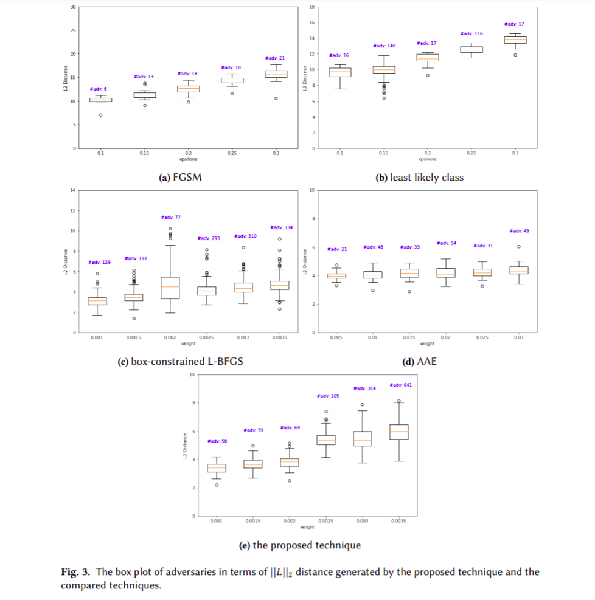
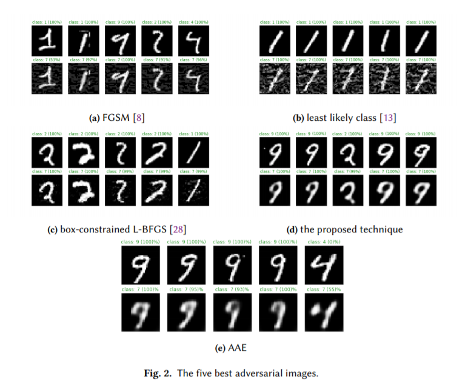

# AdvGeneration
Contain source code of adversarial example generation methods. We try to re-implement existing adversarial example generation methods, then compare these methods with our proposed method. For simplicity, the proposed method is named AE4DNN (Autoencoder For attack Deep Neural Network).

## 1. Installation
Before running, it is mandatory to install necessary packages, which is defined in requirements.txt. Depending on your preference, there are two main ways:
### 1.1. PyCharm
Refer to <a href="https://www.jetbrains.com/help/pycharm/managing-dependencies.html"> this link</a> for further information.

### 1.2. Terminal (such as HPC system)

- Step 1. Change directory to the folder containing requirements.txt

- Step 2: Type: **pip install -r requirements.txt**. This command might take for a few minutes to accomplish.

## 2. Run
Assume you want to run autoencoder.py

### 2.1. PyCharm
Just run directly on GUI

### 2.2. Terminal (such as HPC system)
- Step 1. Set up PYTHONPATH to update search path for module files. Without this command, python will struggle with finding import modules. For example, execute **export PYTHONPATH=/home/anhnd/AdvGeneration/src:$PYTHONPATH** to add **home/anhnd/AdvGeneration/src** to search path.
- Step 2. Change directory to the folder containing the executing file
- Step 3. Type: **python autoencoder.py**

## 3. Experimental results
AE4DNN is compared with FGSM, l.l. class, box-constrained L-BFGS,  Carnili-Wagner  attack, and AAE to demonstrate how it mitigates the trade-off and unstable transferable rate. Specifically, the experiment addresses the following research questions:

- Does AE4DNN produce high quality of adversaries compared to other methods? (RQ1)
- Does AE4DNN require low computational cost compared to other methods? (RQ2)
- Does AE4DNN effectively when dealing with a set of new input vectors? (generalization ability) (RQ3)
- Does the generated adversaries from AE4DNN benefit for attacking other models? (transferable ability) (RQ4)

The research chooses MNIST which is a popular publicly-available dataset for evaluation. The training set contains 50,000 samples. The test set has 10,000 samples.  Each sample on the dataset is an image with 28 pixels in width and 28 pixels in height. The value of each pixel is in range of 0 and 255, which indicates the lightness or darkness of that pixel. Adversarial example in this experiment is called adversarial image for simplicity.

### 3.1. Quality of adversaries in terms of  distance. 
In practice, machine learning testers have no idea about the best value of configurations. Therefore, the testers usually use the strategy try-and-check until they find out the optimal configuration. The experiment in this section follows this strategy. For FGSM, the value of 𝜖 changed from 0.1 to 0.3 with a step of 0.05. For least likely class, the value of 𝜖 changed from 0.1 to 0.3 with a step of 0.03 and the number of iterations is 4. Concerning box-constrained L-BFGS, the value of 𝜖  changed from 0.001 to 0.0035 with a step of 0.0005 and the number of iterations is 20.

### 3.2. Examples

The figure below shows some adversaries generated by the proposed method and comparable methods.

