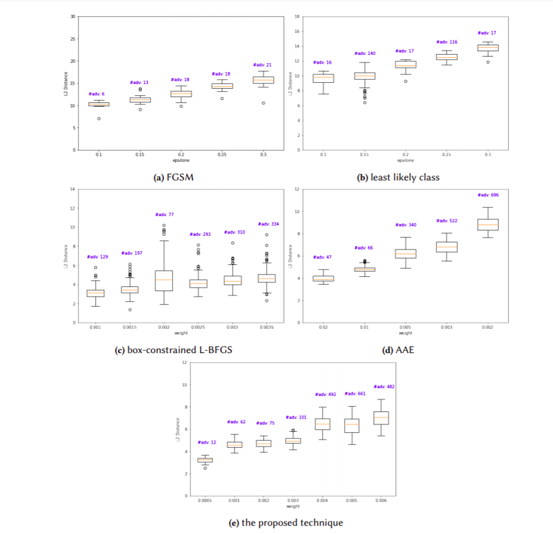

# AdvGeneration

Contain source code of adversarial example generation methods. We try to re-implement existing adversarial example
generation methods, then compare these methods with our proposed method. For simplicity, the proposed method is named
AE4DNN (Autoencoder For attack Deep Neural Network).

If you have any questions, please contact me via nguyenducanh@vnu.edu.vn.

## 1. Installation

Before running, it is mandatory to install necessary packages, which is defined in requirements.txt. Depending on your
preference, there are two main ways:

### 1.1. PyCharm

Refer to <a href="https://www.jetbrains.com/help/pycharm/managing-dependencies.html"> this link</a> for further
information.

### 1.2. Terminal (such as HPC system)

- Step 1. Change directory to the folder containing requirements.txt

- Step 2: Type: **pip install -r requirements.txt**. This command might take for a few minutes to accomplish.

## 2. Run

Assume you want to run autoencoder.py

### 2.1. PyCharm

Just run directly on GUI

### 2.2. Terminal (such as HPC system)

- Step 1. Set up PYTHONPATH to update search path for module files. Without this command, python will struggle with
  finding import modules. For example, execute

**export PYTHONPATH=/home/anhnd/AdvGeneration/src:$PYTHONPATH**

to add **home/anhnd/AdvGeneration/src** to search path.

- Step 2. Change directory to the folder containing the executing file
- Step 3. Type: **python autoencoder.py**

## 3. Experimental results

AE4DNN is compared with FGSM, l.l. class, box-constrained L-BFGS,
Carnili-Wagner  attack, and AAE to demonstrate
how it mitigates the trade-off and unstable transferable rate. Specifically, the experiment addresses the following
research questions:

- Does AE4DNN produce high quality of adversaries compared to other methods? (RQ1)
- Does AE4DNN require low computational cost compared to other methods? (RQ2)
- Does AE4DNN effectively when dealing with a set of new input vectors? (generalization ability) (RQ3)
- Does the generated adversaries from AE4DNN benefit for attacking other models? (transferable ability) (RQ4)

The research chooses MNIST which is a popular publicly-available dataset for evaluation. The training set contains
50,000 samples. The test set has 10,000 samples. Each sample on the dataset is an image with 28 pixels in width and 28
pixels in height. The value of each pixel is in range of 0 and 255, which indicates the lightness or darkness of that
pixel. Adversarial example in this experiment is called adversarial image for simplicity.

### 3.1. Quality of adversaries in terms of  distance.

In practice, machine learning testers have no idea about the best value of configurations. Therefore, the testers
usually use the strategy try-and-check until they find out the optimal configuration. The experiment in this section
follows this strategy. For FGSM, the value of 𝜖 changed from 0.1 to 0.3 with a step of 0.05. For least likely class,
the value of 𝜖 changed from 0.1 to 0.3 with a step of 0.03 and the number of iterations is 4. Concerning
box-constrained L-BFGS, the value of 𝜖 changed from 0.001 to 0.0035 with a step of 0.0005 and the number of iterations
is 20.

### 3.2 Experiment with other autoencoder architectures

#### 3.2.1 Autoencoder 1

The architecture is described as follow:

The average||L||2 distance and the corresponding number of adversaries with different values of β in AE4DNN. Good values
of β are marked in bold

|     β   | 0.0005 | 0.001 | 0.002 | 0.003 | 0.004 | 0.005 |
|:------:|:------:|:-----:|:-----:|:-----:|:-----:|:-----:|
| AVG L2 |   6.4  |  6.4  |  6.62 |  6.71 |  6.6  |  6.73 |
|  # adv |   825  |  856  |  876  |  883  |  883  |  882  |

The average||L||2 distance and the corresponding number of adversaries with different values of φ (AAE).

|     φ   | 0.01 | 0.02 | 0.03 | 0.04 | 0.05 |
|:------:|:----:|:----:|:----:|:----:|:----:|
| AVG L2 | 6.11 | 6.32 | 6.47 | 6.49 | 6.65 |
|  # adv |  99  |  652 |  827 |  843 |  879 |

The comparison betweenAE4DNNand AAE in terms of generalization. Target label is 7. Better values are marked in bold. The
total time to perform 10k-attack, 20k-attack, and 40k-attack are approximate to 1.6 seconds, 3.1 seconds, and 6.3
second, respectively.These attacks do not need to train the autoencoder.

| Config |      0.02      |
|:------:|:--------------:|
|    A   | (0.0005, 0.03) |
|    B   |  (0.0005, 0.04 |
|    C   |  (0.002, 0.05) |

| Config |        | Average L2 | Average Adversarial rate (%) |      |
|:------:|--------|:----------:|------------------------------|------|
|        | AE4DNN | AAE        | AE4DNN                       | AAE  |
|    A   | 6.49   |    6.57    | 82.8                         | 82.9 |
|    B   | 6.49   |     6.6    | 82.8                         | 84.4 |
|    C   | 6.7    |    6.76    | 88.7                         | 89.1 |

The transferable rate between AE4DNN and AAE with different DNN models. Better values are marked in bold

| Config | VGG-13 (%) |      | VGG-16 (%) |      | LeNet-5 (%) |      | AlextNet (%) |     |
|:------:|------------|:----:|------------|------|-------------|------|--------------|-----|
|        | AE4DNN     | AAE  | AE4DNN     | AAE  | AE4DNN      | AAE  | AE4DNN       | AAE |
|    A   | 18         | 13.8 | 21.2       | 11   | 11.8        | 0.8  | 0.2          | 2.8 |
|    B   | 18         | 36.4 | 21.2       | 43.5 | 11.8        | 11.7 | 0.2          | 2.6 |
|    C   | 27         | 51.6 | 30.4       | 36.4 | 2.9         | 4.9  | 3.9          | 0.9 |

3.2.2 Autoencoder 2

The architecture is described as follow:

The average||L||2 distance and the corresponding number of adversaries with different values of β in AE4DNN. Good values
of β are marked in bold

|     β   | 0.0005 | 0.001 | 0.002 | 0.003 | 0.004 | 0.005 |
|:------:|:------:|:-----:|:-----:|:-----:|:-----:|:-----:|
| AVG L2 |  4.87  |  6.82 |  6.77 |  7.74 |  7.57 |  7.49 |
|  # adv |   553  |  870  |  872  |  883  |  883  |  880  |

The average||L||2 distance and the corresponding number of adversaries with different values of φ (AAE).

|    φ    | 0.01 | 0.02 | 0.03 | 0.04 | 0.05 |
|:------:|:----:|:----:|:----:|:----:|:----:|
| AVG L2 | 4.25 | 4.92 | 6.16 | 7.55 | 8.12 |
|  # adv |  39  |  159 |  607 |  782 |  883 |

The comparison betweenAE4DNNand AAE in terms of generalization. Target label is 7. Better values are marked in bold. The
total time to perform 10k-attack, 20k-attack, and 40k-attack are approximate to 1.6 seconds, 3.1 seconds, and 6.3
second, respectively.These attacks do not need to train the autoencoder.

| Config |      (β, φ)      |
|:------:|:--------------:|
|    A   | (0.0005, 0.02) |
|    B   |  (0.003, 0.04 |
|    C   |  (0.004, 0.04) |

| Config |        | Average L2 |        | Average Adversarial rate (%) |
|:------:|:------:|:----------:|:------:|:----------------------------:|
|        | AE4DNN |     AAE    | AE4DNN |              AAE             |
|    A   |  **4.99**  |    5.14    |  **55.35** |             16.37            |
|    B   |  7.85  |    **7.62**    |  **89.47** |             78.32            |
|    C   |  7.67  |    **7.62**    |  **89.09** |             78.32            |

The transferable rate between AE4DNN and AAE with different DNN models. Better values are marked in bold

| Config | VGG-13 (%) |      | VGG-16 (%) |      | LeNet-5 (%) |      | AlextNet (%) |     |
|:------:|------------|:----:|------------|------|-------------|------|--------------|-----|
|        | AE4DNN     | AAE  | AE4DNN     | AAE  | AE4DNN      | AAE  | AE4DNN       | AAE |
|    A   | **18.5**   | 12.3 | **43.8**   | **16**   | 4.3        | 3.3  | 18.1          | 12.2 |
|    B   | **67.3**   | 44.1 | **77.5**   | **54.1** | 10.8        | 5.7 | 59.5          | 44.6 |
|    C   | 40.8       | **44.1** | **81.8**| **54.1** | 4.5         | 5.7  | 55.25          | 54.9 |

### 3.3. Examples

The figure below shows some adversaries generated by the proposed method and comparable methods.

# Useful command

### download file 0_to_1.png from server

scp -P 22033 anhnd@uet-hpc.remote.hpc.farm:/home/anhnd/AdvGeneration/data/mnist/model/0_to_1.png
/Users/ducanhnguyen/Documents

### download folder model from server

scp -P 22033 -r anhnd@uet-hpc.remote.hpc.farm:/home/anhnd/AdvGeneration/data/mnist/model /Users/ducanhnguyen/Documents

### upload local folder src to server

scp -P 22033 -r /Users/ducanhnguyen/Documents/PycharmProjects/AdvGeneration/src anhnd@uet-hpc.remote.hpc.farm:
/home/anhnd/AdvGeneration

